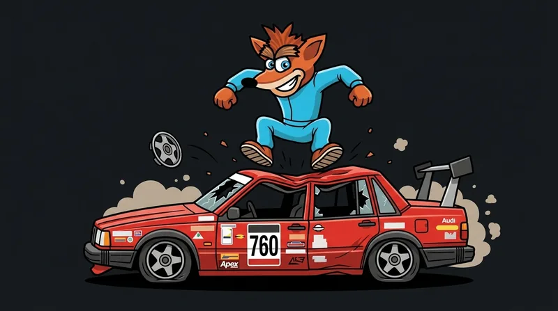

# Undercoot — Live Race Timing & Strategy



Bandicoot Motorwerks #440's pit-wall app. Splash-screen motto: **SUCK IT, RANDY.**

A free-to-host web app for endurance racing teams (built around Lucky Dog Racing League),
powered by the public [Red Mist Timing & Scoring API](https://docs.redmist.racing/).

The app includes:

- a live timing board with lap-time sparklines
- a **predicted next pit for every car**, from driver max stint and fuel window
- inferred driver changes
- **reclass tracking and reclass-risk hints**
- projected finishing order (net of remaining stops)
- a target-position recommender
- a pit/stint planner
- a **Rival** head-to-head with undercut/overcut calls

It is designed for a crew chief on a laptop or tablet in the pits: high contrast, big tabular numerals, and resilient to flaky paddock connections.

## Quick start

```bash
npm run install:all        # installs app/, worker/, tools/recorder
npm run dev                # Vite dev server → http://localhost:5173
```

Open the app and pick a **Dry Run**: a full replay of one of five real Lucky Dog
races (VIR, The Ridge, CMP) rebuilt from public lap data, including reclasses.
You can play, scrub and fast-forward to practise with every feature, with no
credentials or live race needed.

On the timing board, pin your car (☆) to unlock Strategy, Pit Plan and Rival, and
mark rivals with ⚔.

```bash
npm test                   # strategy engine + replay engine unit tests
npm run typecheck          # app + worker
npm run build              # production build → app/dist
npm run fixtures -- --all-ldrl   # refresh Dry Run fixtures from the API
npm run backtest:reclass   # recalibrate the reclass-risk model
```

## Docs

- [CLAUDE.md](CLAUDE.md): contributor standards covering plans, execution and doc freshness
- [docs/architecture.md](docs/architecture.md): data flow, stores, transports, replay
- [docs/data-sources.md](docs/data-sources.md): Red Mist endpoints, auth status, field semantics
- [docs/token-broker.md](docs/token-broker.md): optional worker for the authenticated live feed
- [docs/strategy-models.md](docs/strategy-models.md): the models behind every prediction
- [docs/fixtures.md](docs/fixtures.md): Dry Run fixtures and format
- [docs/brand.md](docs/brand.md): palette, type, logo assets

The app works without credentials. It polls the public results feed, and the
token broker only upgrades it to the sub-second stream.

## Layout

```
app/                  Vite + React + TS SPA
  src/api/redmist/    vendored generated types + JSON decoders
  src/api/            REST client, token provider, SignalR + polling transports
  src/data/           session store (zustand), patch merge, lap log, time utils
  src/replay/         replay engine + transport (Dry Run mode)
  src/strategy/       pace, projections, stints, next pit, reclass, rival, planner (+tests)
  src/ui/             screens & components
worker/               Cloudflare Worker token broker
docs/                 project docs (see above)
tools/recorder/       live recorder (SignalR, or --public polling)
tools/fixtures/       Dry Run fixture builder
tools/analysis/       reclass-model backtest
refs/                 brand source material
```

Strategy outputs are planning estimates, not official timing. Stint rules
(5-min minimum stop etc.) are configurable — always check the event supps.
